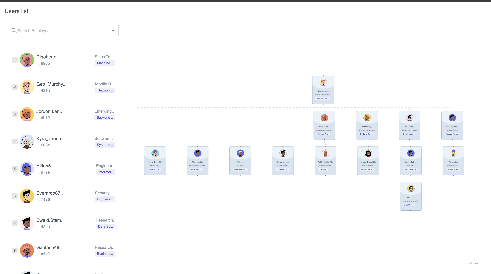
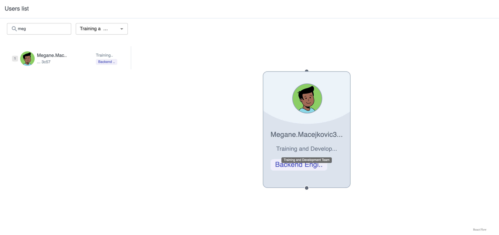

# Deployment Information

Deployed at `firebase` <br/>
Link: https://usergraphs.web.app

# Tech stack Information

-   React
-   Firebase for hosting
-   Material UI for Design

# Installation Guide

### PreRequisties

-   node-version: >18

### To run

```bash
    cd users-app
    npm i
    npm run start
```

### To test

```bash
    npm run test
```


Filter:


# Implementation Details

1. The employee details has been generated randomly.You can find the details here. `src/DataProvider/dummyData.js`
2. We have used 50 as the count to create 50 employees we can change it in the `src/DataProvider/index.js` to change the count of employees.
3. Ther is no relation between the team and the designation since they are randomly chosen.
4. Used `miragejs` to create a dummy server that returns the dummy Employees data.
5. Used `reactFlow` to create the flow where I have created custom node type for the employees details card.

```
const employee = new Employee({
        id,
        name,
        designation,
        team,
        manager,
    });
```

6. The employee object contains the above details where the manager refers to the employee id of his/her manager.The ids are random UUIDs from `faker.js`
7. The graph nodes are created using the employee data where the edges are created using the manager relation.
8. We can able to change the manager of a person by simply dragging him near to the next manager and create a new link between them. In this way the `manager` of the current employee will be changed and updated in the Dummmy DB.
9. On Changing the manager, it changes the state and thus the flow re-renders and everything is aligned properly.

# Usage details.

1. use the search bar to search for a specific employee,you can select the specific team and then can start the search if required. The team select is clearable.
2. Use the right side graph to view the employee-manager relation.
3. The manager of the current employee can be changed by creating a new link to the new manager.

# Demo video:

Link : https://drive.google.com/file/d/10HdfdNktf5RGqDlIgLhW67dDN51h8iNh/view?usp=sharing
